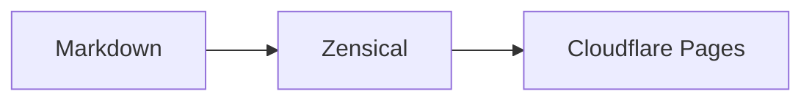
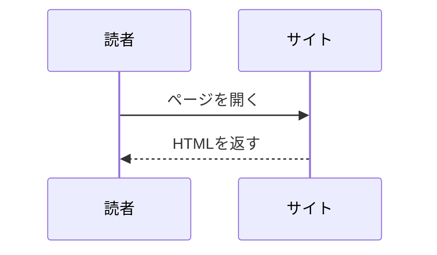
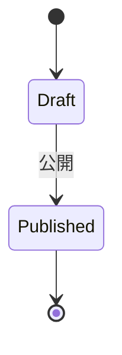
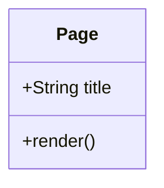
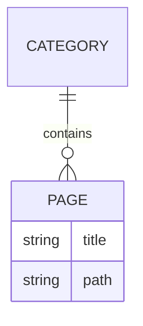

# Markdownリファレンス

この文書は編集者向けです。公開サイトへコピーしません。
以下のコード枠内がMarkdownの記述例です。補足・タブ・リストの内側は半角4スペースでインデントします。
構文を試す場合はローカルの作業ブランチで必要な例だけ確認し、公開用のサンプルページを残さないでください。

## 基本構文

```markdown
# ページタイトル

## 見出し

通常の段落。**太字**、*斜体*、~~取り消し線~~、`インラインコード`。

[外部リンク](https://example.com/)

- 箇条書き
- 箇条書き

1. 順序付きリスト
2. 次の操作

> 引用文。

---

| 項目 | 内容 |
| --- | --- |
| Markdown | 公開コンテンツ |
```

1ページのH1は原則1つにします。内部リンクは`[Home](../index.md)`など、Markdownからの相対パスです。

## Admonition（補足・注意）

```markdown
!!! note
    補足情報です。

!!! warning
    注意が必要です。

!!! danger
    危険な操作です。

!!! info "ネットワーク設定"
    この設定を変更すると通信が切断されます。
```

## Details（折りたたみ）

```markdown
??? note "詳細を見る"
    初期状態は閉じています。

???+ note "詳細を見る"
    初期状態から開いています。
```

長いログ、FAQ、補足説明に使います。見落としてはいけない注意は折りたたみの外へ書きます。

## Content Tabs

````markdown
=== "Linux"

    ```bash
    pwd
    ```

=== "Windows"

    ```powershell
    Get-Location
    ```
````

タブの中には文章、リスト、コードブロックを書けます。

## コード・タイトル・行番号・行ハイライト・Copy

````markdown
```python title="example.py" linenums="1" hl_lines="2"
foo = 1
bar = 2
print(foo + bar)
```
````

言語名でSyntax Highlightを指定します。`title`はファイル名、`linenums`は開始行番号、
`hl_lines`は強調する行です。複数行は`hl_lines="2 4-6"`と書けます。
これらの属性は必要なものだけ付けてください。コードブロックにはテーマ標準のCopyボタンが表示されます。
行番号はコピーするコードへ含まれません。

インラインのSyntax Highlightは次のように書けます。

```markdown
`#!python print("Hello")`
```

## Mermaid

テーマ標準のMermaid対応を使います。図表を外部Webサービスへ送信して生成する必要はありません。
Mermaidのブラウザ用ライブラリはZensicalのテーマが読み込みます。
ライブラリの配信元への通信は必要になる場合があり、完全なオフライン利用を保証する構成ではありません。

### Flowchart

````markdown

````

### Sequence Diagram

````markdown

````

### State Diagram

````markdown

````

### Class Diagram

````markdown

````

### ER Diagram

````markdown

````

## Task List

```markdown
- [x] 完了
- [ ] 未完了
```

チェックはMarkdownで管理します。Web画面で状態を保存するフォームではありません。

## Keyboard Keys

```markdown
++ctrl+alt+delete++

++ctrl+c++
```

## Highlight・上付き・下付き

```markdown
==重要==

H~2~O

2^10^
```

`==...==`は強調、`~...~`は下付き、`^...^`は上付きです。
取り消し線は`~~...~~`です。

## Footnote

```markdown
本文[^1]

[^1]: 補足説明。
```

## Definition List

```markdown
Zensical
:   Markdownから静的サイトを生成するツール。

Cloudflare Pages
:   静的サイトの公開基盤。
```

## Attribute List・画像

画像を`docs/assets/images/`へ追加してから参照します。
次は`docs/index.md`からの例です。

```markdown
{ width="500" }

[リンク](https://example.com/){ title="リンク先の説明" }
```

サブフォルダのページからなら`../assets/images/network.webp`などに調整します。
`width`は最大表示幅の目安です。テーマが狭い画面に合わせて画像を縮小します。

## Icons / Emoji

```markdown
:material-linux:

:material-github:

:fontawesome-brands-github:

:smile:
```

アイコンはZensicalに同梱されたセットを使用します。絵文字画像は標準設定でTwemojiのCDNから読み込みます。
本文の意味を補う箇所だけに使ってください。

## Annotation

コード内の`(1)!`に対応する説明を直後の番号付きリストに書きます。
通常は言語のコメント構文の内側にマーカーを入れます。

````markdown
```python
print("Hello")  # (1)!
```

1. 文字列を標準出力へ表示します。
````

文章の場合は、Markdown in HTMLと`annotate`クラスを使います。

```markdown
<div class="annotate" markdown>

この設定を保存します。(1)

</div>

1. 保存後に設定が反映されます。
```

これは任意の補足記法です。通常の文章はHTMLを使わずに編集できます。

## Columns

標準のPyMdown HTML Blocksを使います。枠の中は通常のMarkdownです。
外側をスラッシュ4つ、内側を3つで囲み、閉じる数を合わせます。

```markdown
//// html | div.columns

/// html | div.column

## Left

左側の内容。

///

/// html | div.column

## Right

右側の内容。

///

////
```

PCでは2列、幅48rem以下では上から順に1列になります。
レイアウトは`docs/stylesheets/extra.css`だけで定義しています。
`/// columns`という独自名は登録していません。上記の標準Generic Block記法を使います。

## Snippets

共通の公開コンテンツが必要になった時点で`docs/includes/`を作ります。
例えば`docs/includes/common-note.md`を作成して、ページに次の行を書きます。

```markdown
--8<-- "includes/common-note.md"
```

パスの基準は常に`docs/`です。相対パスで公開領域外へ出ることやURLからの取得は許可していません。
存在しないファイルの参照はビルドエラーになります。
`editor-docs/`、ルート設定、非公開ファイルを読み込むために制約を緩めないでください。

断片自体を独立したページとして生成しない場合は、追加時に`zensical.toml`の`[project]`へ設定します。

```toml
exclude_docs = """
includes/**
"""
```

断片は取り込み先で公開されるので、ここにも公開可能な内容だけを置きます。
初期構成では`includes/`を作成していません。

## 数式（必要になった時にレンダラーを追加）

Arithmatexの構文処理は有効ですが、初期構成に数式レンダラーは含めていません。
数式を使用する場合は、以下の記法に加えて管理者が一度だけレンダラーを設定します。

```markdown
Inline: \( E = mc^2 \)

\[
E = mc^2
\]
```

MathJaxを使う場合の追加例です。**ブラウザ依存としてMathJax 3.2.2をCDNから読み込む**構成になります。
Pythonの依存関係ではないため`uv.lock`には入りません。バージョン付きURLを設定で固定します。

`zensical.toml`の`[project]`へ追加します。

```toml
extra_javascript = [
  "javascripts/extra.js",
  "https://cdn.jsdelivr.net/npm/mathjax@3.2.2/es5/tex-mml-chtml.js",
]
```

`docs/javascripts/extra.js`を作成します。
これは通常のページ読み込み用です。初期構成ではinstant navigationを有効にしていません。
将来有効にする場合は[Zensical公式の数式連携](https://zensical.org/docs/authoring/math/)に従って再描画を組み込みます。

```javascript
window.MathJax = {
  tex: {
    inlineMath: [["\\(", "\\)"]],
    displayMath: [["\\[", "\\]"]],
    processEscapes: true,
    processEnvironments: true
  },
  options: {
    ignoreHtmlClass: ".*|",
    processHtmlClass: "arithmatex"
  }
};
```

設定後は`uv run zensical build`とプレビューで数式表示を確認してください。
外部配信へ依存できない運用では、同じ版の配布物とライセンスを公開assetsへ配置し、参照先を切り替えます。

## 略語・特殊記号

```markdown
HTML を生成します。

*[HTML]: HyperText Markup Language

(c) (tm) +/-
```

`abbr`、`pymdownx.smartsymbols`、`pymdownx.betterem`も有効です。
略語に続けて日本語を書く場合は空白を挟み、単語の境界を明示します。

## 参照先

- [ZensicalのMarkdown互換性](https://zensical.org/docs/compatibility/markdown/)
- [Zensicalのコードブロック](https://zensical.org/docs/authoring/code-blocks/)
- [Zensicalの数式](https://zensical.org/docs/authoring/math/)
- [PyMdown HTML Blocks](https://facelessuser.github.io/pymdown-extensions/extensions/blocks/plugins/html/)
- [PyMdown Snippets](https://facelessuser.github.io/pymdown-extensions/extensions/snippets/)
